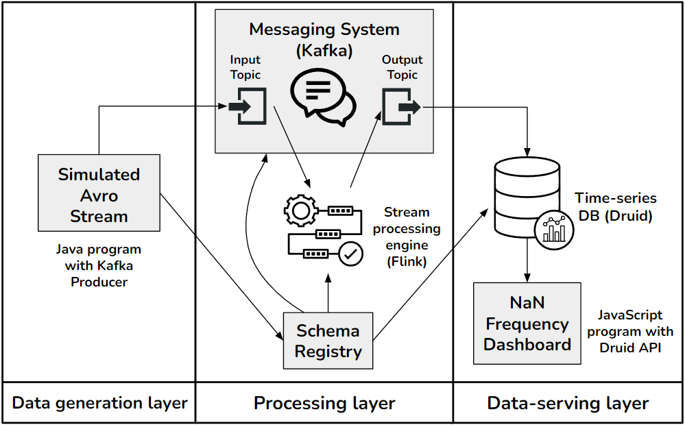

# PoC stream processing pipeline
 Master's thesis repository for a PoC pipeline using Kafka, Flink and Druid.

## Repository summary
This repository contains processing logic for two Kafka producers, a Flink job and Avro (de)serialization. It also contains a docker-compose file for hosting all required pipeline components (Kafka, Flink, Druid, Schema Registry), as well as a very basic HTML-JS dashboard (nodeJS server logic included) for monitoring processing results.

## General instructions
The docker-compose file does not create Kafka topics, so you can either modify it to do so, or you can create them manually as long as you have Kafka installed. Just make sure the topics are named "flinkinput" and "flinkoutput". The compose file also has several fields (for the Kafka brokers and schema registry) where an IP address is required. This field is currently populated with "YOUR.IP.ADDRESS.HERE", so do change it before running the file.

The compose file also lets you choose the desired parallelism degree to use with Flink. Currently, only one TaskManager is configured. As a general rule, set parallelism degree to the number of TaskManagers multiplied by the number of TaskSlots. JMX ports are specified for both Kafka and Flink.

The Kafka producer and Flink logic also require IP addresses for where the brokers and the schema registry are hosted. Currently, these fields are filled with placeholders. Please change to your desired addresses, and make sure it consistent with the docker-compose configuration.

To compile a JAR of the Flink job, run "mvn clean package" in the PoC_Pipeline folder (or use an IDE of your choice). The location of the JAR has to be specified in the docker-compose file (for both the JobManager and the TaskManager(s)). Change the path as required.

The Kafka producers are run as regular Java programs, either through your terminal or IDE. Further instructions are provided in the source files.

## Pipeline structure overview

